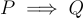

# Formal Logic

A formal logic system consists of:
1. a **language**, the elements of which are called expressions, propositions, statements, and formulas
2. a subset language, the elements of which are taken to serve as *axioms*
3. *inference rules* which say how given certain expressions of the language 

**Theorems** consist of all expressions that can be derived from the axioms and repeated applications of inference rules. It is customary to associate a formal logic system with *semantics*, which prescribe meaning for the expressions of the language, together with a means for determining if these are true or false.

- *Soundness* (Consistency): If an expression is a theorem, then it is true
- *Adequacy* (Completeness): If an expression is true then it is a theorem

Soundness/Consistency means that one cannot prove things are not true, and adequacy / completeness means that the axioms and rules are sufficient to prove everything true.

An inference rule is said to be valid in a given semantics if it only allows one to derive true conclusions from true premises. 

If a formal system is sound and complete with respect to its semantics, then an inference rule will be formally valid if and only if it is semantically valid. 

A proposition using the form '∨', is called a *disjunction*, and the P and Q are called *disjuncts*. A proposition using the for '∧' is called a *conjunction*, and P and Q are called *conjunction*. In the premise shown above P is the **premise**, or the **antecedent**. Q is the **conclusion** or **consequent**.

A proposition P is a *tautology* if *v*(P) = T for all truth value assignments of *v*. 

### Propositional Calculus

1.  Propositional symbols: $p_1$, $p_2$, etc
2. Truth symbols: **True, False**
3. Logical connectives: ¬, ∨, ∧, →, ≡
4. Parentheses: ()

Propositions are defined by propositional symbols, and the logical correctives should be able to be correctly applied to them. Nothing else is a proposition. 

A proposition using the form $P \lor Q$ is called a **disjunction**, and P and Q are **disjuncts**. A proposition using the form $P \land Q$ is called are called **conjuncts**. In an implication $P \implies Q$, P is the **premise** or the **antecedent** and Q is the **conclusion** or **consequence**. Propositions may also be refereed to as **well-formed formulas**.

A proposition is a tautology if no matter the truth values occurring in  $v(P) = T$, this means for pT and pF the proposition is true. 

### Laws in Formal Logic
- Contrapositive law: P → Q ≡ ¬Q → ¬P
- De Morgan’s Law 1: ¬(P ∨ Q) ≡ ¬P ∧ ¬Q
- De Morgan’s Law 2: ¬(P ∧ Q) ≡ ¬P ∨ ¬Q
- Commutative Law 1: P ∧ Q ≡ Q ∧ P
- Commutative Law 2: P ∨ Q ≡ Q ∨ P
- Associative Law 1: (P ∧ Q) ∧ R ≡ P ∧ (Q ∧ R)
- Associative Law 2: (P ∨ Q) ∨ R ≡ P ∨ (Q ∨ R)
- Distributive Law 1: P ∨ (Q ∧ R) ≡ (P ∨ Q) ∧ (P ∨ R)
- Distributive Law 2: P ∧ (Q ∨ R) ≡ (P ∧ Q) ∨ (P ∧ R)

### Predicate Calculus
If the weather is rainy we can express this through the **predicate** `weather(tuesday, rain)`. Through inference rules we can manipulate predicate calculus expressions, accessing their individual components and inferring new sentences. Predicate calculus can also contain variables. We will adopt the syntax used in prolog.

A term is considered to be *closed* if it does not contain variable symbols. A term of this kind that involves a function symbol may be called a *function expression* and the number *n* is refereed to as the symbols *arity.* These are also known as *first order formulas*. 

We can overload the likes operation through using the $\forall$ operator. This symbol is known as the *universal quantifier*.  The symbol $\exists$ is known as the *existential qualifier*. 

### Semantic Interpretations
An *interpretation* for a first order language L consists of:
- A nonempty set $D_1$ serving as the domain, the elements of which are called *individuals*
- For each constant symbol $a$ in L, assignment of a unique individual $a_1$ in $D_1$. In this case let I(a) denote $a_1$ 
- For each variable symbol V in L, assignment of a subset $V_1$ of $D_1$ (to serve as the range for possible values of V)
- For each n-ary function symbol f in L, assignment of a function $f: D^{n}_{I} \implies D_1$ 
- For each n-ary predicate symbol p in L, assignment of a predicate (relation) $p_1 on D^{n}_{I}$ 

Constant symbols are used to represent individual objects in some domain of discourse, variable symbols are taken to a range of subsets.

