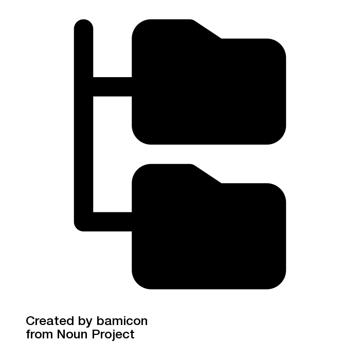
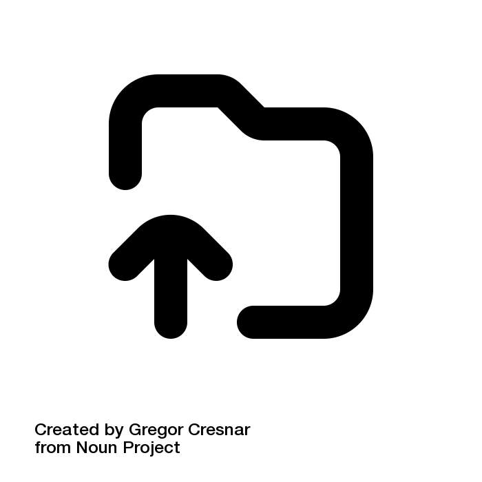

## Convolution

<b>Convolution</b> is a fundamental process in image processing. Through convolution we apply a mathematical operator to each of the pixels in order to change its value in some way. We apply these changes using a matrix known as a [kernel](kernel.md).  The kernel is smaller in size than the input image.

<blockquote>For each pixel in the image, we take the kernel and
place it on top such that the center of the kernel coincides with the pixel under
consideration. We then multiply each value in the kernel matrix with the corresponding
values in the image, and then sum it up. This is the new value that will be substituted in
this position in the output image.</blockquote>

The kernel may be called an image filter. Depending on the value of the kernel it applies different operations such as [blurring](Blurring.md) and [edge detection](Edge_Detection.md). The kernel is held by a matrix, so this should help you visualize what a kernel will appear as. 

## Code Examples

```py
# From ---- https://learnopencv.com/image-filtering-using-convolution-in-opencv/

import cv2
import numpy as np
 
image = cv2.imread('test.jpg')
 
# Print error message if image is null
if image is None:
    print('Could not read image')
 
# Apply identity kernel
kernel1 = np.array([[0, 0, 0],
                    [0, 1, 0],
                    [0, 0, 0]])
 
identity = cv2.filter2D(src=image, ddepth=-1, kernel=kernel1)
 
cv2.imshow('Original', image)
cv2.imshow('Identity', identity)
     
cv2.waitKey()
cv2.imwrite('identity.jpg', identity)
cv2.destroyAllWindows()
 
# Apply blurring kernel
kernel2 = np.ones((5, 5), np.float32) / 25
img = cv2.filter2D(src=image, ddepth=-1, kernel=kernel2)
 
cv2.imshow('Original', image)
cv2.imshow('Kernel Blur', img)
     
cv2.waitKey()
cv2.imwrite('blur_kernel.jpg', img)
cv2.destroyAllWindows()
```

```cpp
// ------ cpp example ------ // 
// From -- https://learnopencv.com/image-filtering-using-convolution-in-opencv/

#include <opencv2/opencv.hpp>
#include <iostream>
 
// Using namespaces to nullify use of c::function(); syntax and std::function(); syntax
using namespace std;
using namespace cv;
 
int main()
{
    // Read Image
    Mat image = imread("test.jpg");
 
    // Print Error message if image is null
    if (image.empty()) 
        {
            cout << "Could not read image" << endl;
        }
     
    // Apply identity filter using kernel
    Mat kernel1 = (Mat_<double>(3,3) << 0, 0, 0, 0, 1, 0, 0, 0, 0);
    Mat identity; 
    filter2D(image, identity, -1 , kernel1, Point(-1, -1), 0, 4);
    imshow("Original", image);
    imshow("Identity", identity);
    waitKey();
    imwrite("identity.jpg", identity);
    destroyAllWindows();
 
    // Blurred using kernel
    // Initialize matrix with all ones
    Mat kernel2 = Mat::ones(5,5, CV_64F);
    // Normalize the elements
    kernel2 = kernel2 / 25;
    Mat img;
    filter2D(image, img, -1 , kernel2, Point(-1, -1), 0, 4);
    imshow("Original", image);
    imshow("Kernel blur", img);
    imwrite("blur_kernel.jpg", img);
    waitKey();
    destroyAllWindows();
}
```

## Navigation

- [Root Dir](../Index.md) 
- [Parent Dir](../Chapter_2.md) 


